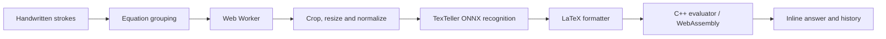

## <a href="https://code-alchemists-gilt.vercel.app/" target="_blank" rel="noopener noreferrer">Click this link to use the app → CalcInk on Vercel</a>

No installation needed. Open the link, wait for **Handwriting model ready**, and write an equation ending in **`=`**.

To open the app in a new tab from GitHub, **Ctrl-click** the link (Windows/Linux) or **Cmd-click** it (macOS). GitHub removes new-tab attributes from rendered README links.

---

# CalcInk · Draw & Calculate

**A digital scratchpad that turns handwritten arithmetic into answers, right beside your ink.**

Built by **Code Alchemists**, CalcInk combines a movable drawing canvas, on-device handwriting recognition, and a C++ calculator running through WebAssembly. Write with a mouse, touch, or pen; edit your work and let the result update in place.

**<a href="https://code-alchemists-gilt.vercel.app/" target="_blank" rel="noopener noreferrer">Try the live app</a> · [Run locally](#run-locally) · [How it works](#how-it-works) · [Tests](#tests)**

## Start writing

1. Open the <a href="https://code-alchemists-gilt.vercel.app/" target="_blank" rel="noopener noreferrer">live app</a> and wait for the model to finish loading.
2. Select **Pencil** and write a horizontal expression ending in `=`.
3. Pause briefly. CalcInk recognizes the expression and places its answer beside it.
4. Write another equation on a separate row or alongside it, leaving a clear gap.
5. Erase a number and write a replacement to update that equation's result.

For example, write these as separate equations:

```text
2 + 3 =          → 5
18 + 4 × 3 =     → 30
12.5 − 2 =       → 10.5
8 ÷ 2 =          → 4
```

The examples show the expected arithmetic results. Actual recognition depends on the handwriting.

## What you can do

| Feature | Experience |
| --- | --- |
| **Multiple equations** | Write independent calculations on separate rows or side by side; each gets its own inline answer. |
| **Reactive editing** | Change an equation to recalculate it while other equations keep their answers. |
| **Infinite canvas** | Pan and zoom around a workspace that extends beyond the visible page. |
| **Pencil & colours** | Choose from six ink colours and adjust pencil thickness. |
| **Highlighter** | Add translucent annotations without sending them to the math recognizer. |
| **Two eraser modes** | Remove entire strokes or erase portions of a stroke. |
| **Undo & redo** | Restore drawing, highlighting, erasing, and Clear actions, with up to 100 actions retained. |
| **Calculation history** | View the latest 10 evaluations, including repeats; entries remain after editing, erasing, or clearing the canvas. |
| **High-DPI rendering** | Keep logical stroke positions stable while adapting the canvas bitmap to display density. |
| **Local processing** | Run recognition in a browser worker and arithmetic in WebAssembly, without a Python server or cloud inference API. |

## Controls

| Action | Control |
| --- | --- |
| Write | Pencil tool; mouse, pen, or primary touch pointer |
| Annotate | Highlighter tool |
| Erase | Eraser tool, then select **Stroke eraser** or **Pixel eraser** |
| Adjust thickness / eraser diameter | Size slider; tools remember their own settings |
| Move the canvas | Hand tool, **Space + drag**, or middle-button drag |
| Pan | Mouse wheel / trackpad scroll; **Shift + wheel** for horizontal movement |
| Zoom | **Ctrl/Cmd + wheel**, or the **− / +** buttons |
| Reset the view | Home button in the zoom controls |
| Undo | **Ctrl/Cmd + Z** |
| Redo | **Ctrl/Cmd + Shift + Z**, or **Ctrl + Y** on Windows |
| Clear | **Clear** button; clearing ink is undoable |
| View calculations | **History** button; close with its close button, Escape, or an outside click |

Keep a visible gap between equations. Grouping uses stroke geometry rather than fixed notebook rows. Within an equation, larger handwriting allows wider symbol gaps, and aligned equals strokes stay together. Overlapping or tightly packed independent equations can still be grouped incorrectly.

## How it works



### 1. Capture and group the ink

The drawing controller stores stroke coordinates in world space. Each equation has an identity, revision, and associated strokes. Pan and zoom change the view rather than the saved handwriting. Highlighter annotations stay separate from equation ink.

### 2. Recognize one equation at a time

A dedicated **Web Worker** prepares the equation's strokes using **OffscreenCanvas**: it renders black equation ink on white, crops the white border, resizes proportionally to fit 448 × 448, and normalizes grayscale pixels using TexTeller's mean (0.9545467) and standard deviation (0.15394445). Bottom/right padding is zero in normalized tensor space. Canvas high-quality interpolation approximates the upstream bicubic resize.

**TexTeller ONNX** runs its quantized encoder and uncached decoder through **ONNX Runtime Web**, using Hugging Face Tokenizers to decode LaTeX. The adapter removes matching outer math delimiters such as `\[...\]` before passing the expression to the existing formatter. Greedy decoding ends at the model's end token; requests exceeding 256 generated tokens report an error instead of calculating a truncated expression. Pending equations are processed sequentially, and revision checks prevent outdated responses from replacing newer edits. Preprocessing and inference are separated from the drawing thread.

### 3. Format and calculate

The JavaScript formatter removes whitespace and converts recognized notation into arithmetic:

| Recognized notation | Evaluator input |
| --- | --- |
| `\times` or `×` | `*` |
| `\div` or `÷` | `/` |
| `−` | `-` |
| `\frac{a}{b}` | `(a)/(b)` |

Digits, decimals, parentheses, and basic arithmetic operators are supported. Unsupported commands, powers (`^`), and subscripts (`_`) are rejected. The formatter keeps text through the **first `=`**, treating it as the calculation delimiter; any text after it is ignored.

The **C++ evaluator** converts the expression to postfix form and evaluates it with operator precedence, unary signs, and parentheses. It handles invalid syntax through controlled errors, reports division by zero as **Undefined**, and uses no JavaScript `eval()`.

### 4. Keep results attached to the page

Answers are display elements, so they never become recognition input. Editing invalidates only the affected equation. Stroke fragments retain their equation membership through pixel erasing and history restoration. Answers move with the canvas during navigation.

## Technology

| Layer | Choice |
| --- | --- |
| Interface | HTML, CSS, and JavaScript |
| Drawing | Canvas 2D, Pointer Events, and high-DPI scaling |
| Background processing | Web Workers and OffscreenCanvas |
| Recognition | onnx-community/TexTeller-ONNX (quantized) |
| Inference runtime | ONNX Runtime Web, WASM execution provider |
| Arithmetic | C++ compiled to WebAssembly with Emscripten |
| Development & build | Vite |
| Hosting | Vercel |
| Automated checks | Node.js test runner |

The TexTeller quantized encoder and decoder total approximately **316 MB**. Before development or building, npm downloads missing assets from Hugging Face into the ignored `public/models/texteller/` directory. Completed files are reused on subsequent runs. The browser loads these files from the app's own origin; inference does not require browser requests to Hugging Face. Model assets and the inference runtime are loaded before recognition can begin. A single WASM inference thread runs inside the worker, without requiring cross-origin isolation headers.

## Run locally

Use **Node.js 24.12.0**, recorded in `.nvmrc`, and a modern browser supporting Pointer Events, ResizeObserver, Web Workers, OffscreenCanvas, and WebAssembly.

```bash
git clone https://github.com/SantoshP2608/Code-Alchemists.git
cd Code-Alchemists
npm ci
npm run dev
```

Vite opens the frontend. If needed, visit **http://localhost:5173/frontend/index.html**, or use the address printed in your terminal.

Keep the development server running. Open the HTTP address rather than double-clicking an HTML file: JavaScript modules, workers, and model assets need HTTP serving. The precompiled calculator files are included, so Emscripten is not required just to run the app.

## Build and deployment

```bash
npm run build
```

The build writes to **`dist/`**. The `prebuild` script downloads missing TexTeller files, then Vite copies the public model assets into `dist/models/texteller/`, builds the worker and ONNX WASM runtime, and copies the page to `dist/index.html`. The pinned model revision and file list are in `backend/texteller-config.js`. Build machines need HTTPS access to Hugging Face and its download CDN; browsers only need access to the hosted app. Hosting must support the 228 MB decoder file and the overall model size.

To download assets separately or retry an interrupted download, run `npm run models:download`. Incomplete downloads use `.part` files and are never served as completed weights.

| Vercel setting | Value |
| --- | --- |
| Build command | `npm run build` |
| Output directory | `dist` |

## Project structure

```text
Code-Alchemists/
├── frontend/
│   ├── index.html              # App layout and controls
│   ├── style.css               # Responsive notebook styling
│   └── script.js               # Older implementation; not the active controller
├── backend/                    # Browser-side processing, despite the folder name
│   ├── app.js                  # Drawing, equations, history, and navigation
│   ├── recognition.worker.js   # Model startup and recognition requests
│   ├── texteller.js            # TexTeller sessions and token decoding
│   ├── texteller-config.js     # Pinned model revision and asset paths
│   ├── preprocessing.js        # TexTeller grayscale preprocessing
│   ├── formatter.js            # LaTeX-to-arithmetic conversion
│   ├── stroke-renderer.js      # Pencil and highlighter rendering
│   ├── inference-resources.js  # Recognition tensor cleanup
│   ├── evaluate.cpp            # Arithmetic evaluator source
│   ├── evaluate.js             # Generated WebAssembly loader
│   └── evaluate.wasm           # Compiled calculator
├── tests/                      # Automated regression checks
├── docs/                       # Canvas design and quality audit
├── scripts/download-texteller.mjs # Download missing model assets
├── public/models/texteller/    # Local model assets (ignored by Git)
├── package.json
├── package-lock.json
├── vite.config.js
└── .nvmrc
```

The active page loads **`backend/app.js`**. Despite its name, `backend/` contains the browser-side application logic; there is no running Python backend. The legacy `backend/requirements.txt` is not needed for the active app.

## Tests

```bash
npm test
```

**93 automated tests pass after the grouping, model-loading and history fixes.** Coverage includes large handwriting gaps at different zoom levels, equals-bar grouping, separate equations, drawing history, both eraser modes, colours and highlighters, stale worker replies, startup recovery, canvas navigation, proportional answer sizing and readability at reduced zoom, display-density changes, TexTeller decoding, and inference resource cleanup.

Tests use controlled DOM, canvas, and worker boundaries. They verify application behavior but do not measure real handwriting accuracy, frame rate, or long-session browser memory usage. Node's experimental VM Modules warning is expected for this test setup.

For a browser check, draw two spaced equations ending in `=`, edit one, then try Undo, Redo, Clear, both erasers, pan, and zoom. Confirm that answers remain paired with the correct equations.

## Processing and practical limits

- **On-device calculations:** handwriting preprocessing, model inference, and arithmetic run inside the browser. No cloud vision or math API is used by this pipeline.
- **Initial loading:** network access is needed to load the website, model, and runtime assets. Processing can run locally once those assets are ready; this is not a guarantee that a fresh page load or offline reload will work. There is no service-worker installation flow in the current code.
- **Recognition:** symbol shapes, spacing, and writing style affect accuracy. TexTeller recognizes general LaTeX, but the calculator supports basic arithmetic only. Recognition is not guaranteed; the formatter and evaluator cannot repair a misread number or operator.
- **Session storage:** drawing and calculation history live in memory and reset on refresh. Clear removes canvas equations and answers while keeping calculation history; Undo restores the ink and schedules recalculation, which adds new history entries.
- **History limits:** drawing history retains 100 actions. Calculation history is a queue of the latest 10 evaluations, displayed newest first; each result is appended and the oldest is removed when full. Repeated results occupy separate entries, regardless of whether the original ink remains on the canvas.
- **Scope:** multiple independent equations are supported. This is not a general symbolic algebra engine or a solver for expressions with variables, powers, or subscripts.

For implementation details and audit limits, see [Infinite canvas and multiple equations](docs/infinite-canvas.md) and [Quality checklist](docs/quality-checklist.md). The checklist distinguishes historical browser checks from TexTeller verification.

## Model attribution

CalcInk uses [onnx-community/TexTeller-ONNX](https://huggingface.co/onnx-community/TexTeller-ONNX), an Apache-2.0 ONNX export of [OleehyO/TexTeller](https://github.com/OleehyO/TexTeller). Setup downloads use revision `9727784d91d7f8437dc7140941c4335284ce075e`, with `encoder_model_quantized.onnx`, `decoder_model_quantized.onnx`, model configuration, and tokenizer files from that same revision. Downloaded assets are served locally and excluded from Git. No previous recognition weights or vocabulary remain in this checkout.

Inference uses [ONNX Runtime Web](https://github.com/microsoft/onnxruntime) and [Hugging Face Tokenizers](https://github.com/huggingface/tokenizers.js). Input normalization follows [TexTeller's preprocessing](https://github.com/OleehyO/TexTeller/blob/main/texteller/utils/image.py). The model has no image-processor configuration or merged/cached decoder, so the app uses its encoder and decoder sessions directly instead of an image-to-text pipeline.

---

**Pick up the pencil and try it: <a href="https://code-alchemists-gilt.vercel.app/" target="_blank" rel="noopener noreferrer">Click this link to use CalcInk</a>.**
